# Deep Learning Project


# Objective

The objective of the project is to train a deep neural network able to identify a specific person on camera images from a drone. This person is then tracked and followed by the drone.

The neural network is a fully convolutional network, meaning its output is an entire picture that identifies for each pixel, whether it is part of the tracked person, of another person, or of the background.

# Data collection

The data is composed of images from the camera drone as well as a ground truth mask identifying the class for each pixel (tracked person, untracked person, or background).

The first step to have a functioning neural network is to have good data for training. A great architecture in itself will not be functioning if the following thoughts have not been considered in data collection:
* do I have enough data to prevent overfitting
* does the data collected cover all possible scenarios
* is my data well split over the different classes and environments that I want to identify

In order to satisfy all the above mentioned conditions, more data was collected from 7 different runs, which resulted in a total of 7528 training samples.

Here are the different scenarios that were covered:
* Drone patrolling in different environments (trees, streets, alleys…), at different heights, with people in the background (very few pictures with tracked person as we need specific runs for it).

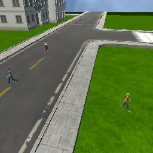
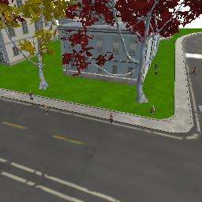
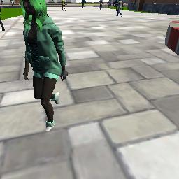

* Drone patrolling in different environments and height, with our tracked person, with or without other people, and through different angles. This is achieved by making our target zigzag within a short perimeter and have our drone patrol around it.

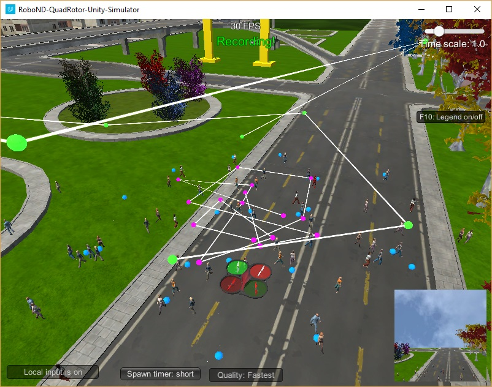

* Drone following actively our tracked person.

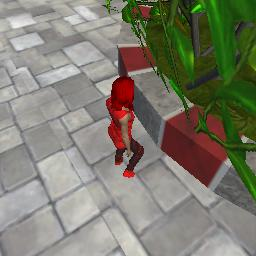
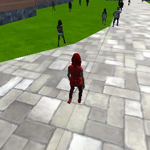
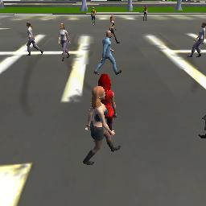

We ensured that the collected categories were split evenly to achieve a good performance in all conditions.

# Neural network architecture

## Individual layers

Most networks applied to images contain similar layers. We will describe briefly each type of layer used in proposed architecture.

### Convolutions

Two types of convolutions are used in this network:
* regular convolutions
* separable convolutions

The difference between a regular convolution and a separable convolution is that the filter is applied simultaneously on all the channels in a regular convolution while it is applied separately on each channel in a separable convolution, after which a 1x1 depth convolution is applied on the channels.

This difference lets the separable convolution use order of magnitude fewer parameters than an "equivalent" regular convolution while leading to similar performances. Through the use of separable convolutions, we can create deeper and larger networks.

Each convolution layer is followed by a batch normalization, which normalizes the incoming layer and usually improves training.

```python
def separable_conv2d_batchnorm(input_layer, filters, strides=1):
    output_layer = SeparableConv2DKeras(filters=filters,kernel_size=3, strides=strides,
                             padding='same', activation='relu')(input_layer)
    
    output_layer = layers.BatchNormalization()(output_layer) 
    return output_layer

def conv2d_batchnorm(input_layer, filters, kernel_size=3, strides=1):
    output_layer = layers.Conv2D(filters=filters, kernel_size=kernel_size, strides=strides, 
                      padding='same', activation='relu')(input_layer)
    
    output_layer = layers.BatchNormalization()(output_layer) 
    return output_layer
```

### Upsampling

For the architecture that we selected, our network creates smaller inputs in height/width and larger in depth. The height/width needs to eventually increase back to its initial value in order to classify each pixel. This is achieved through bilinear upsampling, which basically uses interpolation to recreate a larger image.

```python
def bilinear_upsample(input_layer):
    output_layer = BilinearUpSampling2D((2,2))(input_layer)
    return output_layer
```

### Encoder block

An encoder block is simply made of a separable convolution as detailed previously. We use them to create deeper layers, and set the `stride` parameter to define the output size we are trying to reach.

In our architecture, each encoder block usually multiplies the depth by 2 and divides height and width by 2 (by choosing a stride of 2).

```python
def encoder_block(input_layer, filters, strides):

    # Create a separable convolution layer using the separable_conv2d_batchnorm() function.
    output_layer = separable_conv2d_batchnorm(input_layer, filters, strides)

    return output_layer
```

### Decoder block

A decoder block creates an output opposite to the one of the encoder block. The depth decreases while height and width increase. It also uses a previous layer from the architecture through skip connections in order to have finer details.

The steps that are performed are the following:
* First, we upsample our layer by performing a bilinear interpolation.
* Then, we concatenate our upsampled layer with an earlier layer from our architecture with the same size.
* We finally apply two separable convolutions on the concatenation to generate new features.

This process let us benefit from both the finer details from early layers and the features currently identified.

```python
def decoder_block(small_ip_layer, large_ip_layer, filters):

    # Upsample the small input layer using the bilinear_upsample() function.
    upsample = bilinear_upsample(small_ip_layer)

    # Concatenate the upsampled and large input layers using layers.concatenate
    concat = layers.concatenate([upsample, large_ip_layer])

    # Add some number of separable convolution layers
    conv_1 = separable_conv2d_batchnorm(concat, filters)
    output_layer = separable_conv2d_batchnorm(conv_1, filters)

    return output_layer
```

## Model

The model has been created by using a succesion of:
* 4 encoder blocks
* a 1x1 convolution layer to obtain deeper features
* 4 decoder blocks

It returns an output of the same width/height as the input and with a depth of 3 to return the probability of belonging to each of the 3 classes previously defined.

The number of blocks used as well as the number of filters (which starts at 16 and is doubled with each encoding block) has been refined by testing different models, considering final accuracy, speed of training, and size of network.

```python
def fcn_model(inputs, num_classes):
    
    # Add Encoder Blocks.
    n = 16
    layer_1 = encoder_block(inputs, filters=n, strides=2)
    layer_2 = encoder_block(layer_1, filters=2*n, strides=2)
    layer_3 = encoder_block(layer_2, filters=4*n, strides=2)
    layer_4 = encoder_block(layer_3, filters=8*n, strides=2)

    # Add 1x1 Convolution layer using conv2d_batchnorm().
    encoded = conv2d_batchnorm(layer_4, filters=8*n, kernel_size=1, strides=1)

    # Add the same number of Decoder Blocks as the number of Encoder Blocks
    decoder_4 = decoder_block(encoded, layer_3, filters=8*n)
    decoder_3 = decoder_block(decoder_4, layer_2, filters=4*n)
    decoder_2 = decoder_block(decoder_3, layer_1, filters=2*n)
    x = decoder_block(decoder_2, inputs, filters=n)

    # The function returns the output layer of your model. "x" is the final layer obtained from the last decoder_block()
    return layers.Conv2D(num_classes, 1, activation='softmax', padding='same')(x)
```

Here is an overview of the neural network architecture.


And here is a better outline of each layer as well as its parameters.

    _________________________________________________________________
    Layer (type)                 Output Shape              Param #   
    =================================================================
    input_1 (InputLayer)         (None, 160, 160, 3)       0         
    _________________________________________________________________
    separable_conv2d_keras_1 (Se (None, 80, 80, 16)        91        
    _________________________________________________________________
    batch_normalization_1 (Batch (None, 80, 80, 16)        64        
    _________________________________________________________________
    separable_conv2d_keras_2 (Se (None, 40, 40, 32)        688       
    _________________________________________________________________
    batch_normalization_2 (Batch (None, 40, 40, 32)        128       
    _________________________________________________________________
    separable_conv2d_keras_3 (Se (None, 20, 20, 64)        2400      
    _________________________________________________________________
    batch_normalization_3 (Batch (None, 20, 20, 64)        256       
    _________________________________________________________________
    separable_conv2d_keras_4 (Se (None, 10, 10, 128)       8896      
    _________________________________________________________________
    batch_normalization_4 (Batch (None, 10, 10, 128)       512       
    _________________________________________________________________
    conv2d_1 (Conv2D)            (None, 10, 10, 128)       16512     
    _________________________________________________________________
    batch_normalization_5 (Batch (None, 10, 10, 128)       512       
    _________________________________________________________________
    bilinear_up_sampling2d_1 (Bi (None, 20, 20, 128)       0         
    _________________________________________________________________
    concatenate_1 (Concatenate)  (None, 20, 20, 192)       0         
    _________________________________________________________________
    separable_conv2d_keras_5 (Se (None, 20, 20, 128)       26432     
    _________________________________________________________________
    batch_normalization_6 (Batch (None, 20, 20, 128)       512       
    _________________________________________________________________
    separable_conv2d_keras_6 (Se (None, 20, 20, 128)       17664     
    _________________________________________________________________
    batch_normalization_7 (Batch (None, 20, 20, 128)       512       
    _________________________________________________________________
    bilinear_up_sampling2d_2 (Bi (None, 40, 40, 128)       0         
    _________________________________________________________________
    concatenate_2 (Concatenate)  (None, 40, 40, 160)       0         
    _________________________________________________________________
    separable_conv2d_keras_7 (Se (None, 40, 40, 64)        11744     
    _________________________________________________________________
    batch_normalization_8 (Batch (None, 40, 40, 64)        256       
    _________________________________________________________________
    separable_conv2d_keras_8 (Se (None, 40, 40, 64)        4736      
    _________________________________________________________________
    batch_normalization_9 (Batch (None, 40, 40, 64)        256       
    _________________________________________________________________
    bilinear_up_sampling2d_3 (Bi (None, 80, 80, 64)        0         
    _________________________________________________________________
    concatenate_3 (Concatenate)  (None, 80, 80, 80)        0         
    _________________________________________________________________
    separable_conv2d_keras_9 (Se (None, 80, 80, 32)        3312      
    _________________________________________________________________
    batch_normalization_10 (Batc (None, 80, 80, 32)        128       
    _________________________________________________________________
    separable_conv2d_keras_10 (S (None, 80, 80, 32)        1344      
    _________________________________________________________________
    batch_normalization_11 (Batc (None, 80, 80, 32)        128       
    _________________________________________________________________
    bilinear_up_sampling2d_4 (Bi (None, 160, 160, 32)      0         
    _________________________________________________________________
    concatenate_4 (Concatenate)  (None, 160, 160, 35)      0         
    _________________________________________________________________
    separable_conv2d_keras_11 (S (None, 160, 160, 16)      891       
    _________________________________________________________________
    batch_normalization_12 (Batc (None, 160, 160, 16)      64        
    _________________________________________________________________
    separable_conv2d_keras_12 (S (None, 160, 160, 16)      416       
    _________________________________________________________________
    batch_normalization_13 (Batc (None, 160, 160, 16)      64        
    _________________________________________________________________
    conv2d_2 (Conv2D)            (None, 160, 160, 3)       51        
    =================================================================
    Total params: 98,569
    Trainable params: 96,873
    Non-trainable params: 1,696

We can clearly see that the network is large with close to 100,000 parameters and is deep with several convolution layers, letting it capture complex features.

## Training

Several hyperparameters had to be tuned for training:
* learning rate = 0.005. The value of 0.01 was first selected as it is common with selected optimizer (Adam). It was then decreased to 0.001 to obtain a better accuracy but the learning became then too slow so we used 0.005 which performed well.
* batch size = 8. Here we selected the maximum value that our hardware could handle. Based on the large number of parameters, we could not use a higher batch size due to GPU limitations.
* num epochs = 50. Usually the longer we train, the better accuracy we obtain (unless there is overfitting). We wanted the network to run for no more than 2 hours so set this value so that it would finish within this time frame.
* training and validation steps per epoch were simply the result of the number of samples divided by the batch size.

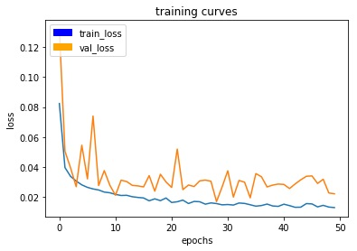

We can clearly see that the training curve decreases over time. The validation curve displays a lot of noise which is due to the fact that we had a smaller number of images (1184) and that we didn't try to optimize our data set by collecting more images.

## Results

The network achieved a performance of 49.3% based on Udacity metrics (refer to [`ORIGINAL_README`](ORIGINAL_README.md)).

The following pictures show:
- left: camera image
- middle: ground truth
- right: neural network prediction

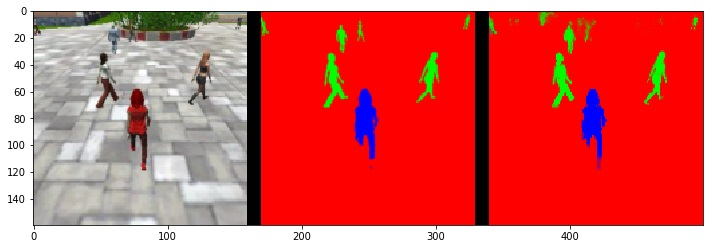

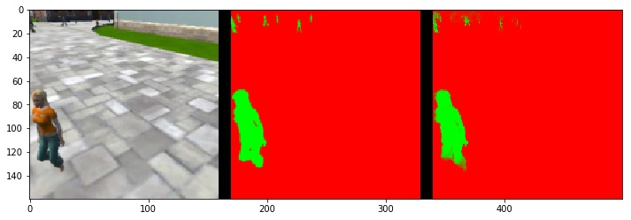

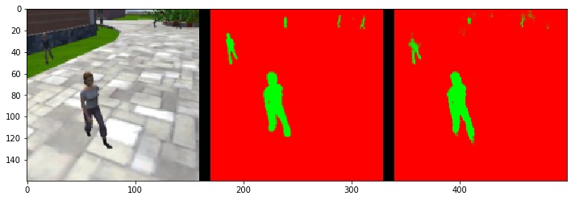

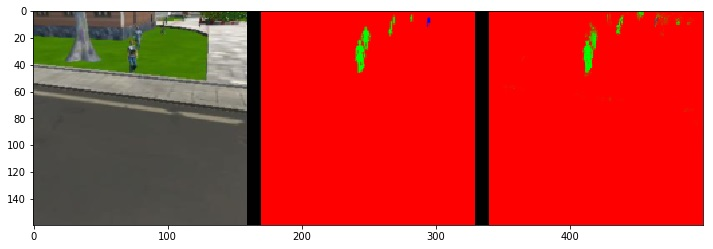

The results are impressive, with the network detecting people that are difficult to see on the image.

We can however see on the last picture that the target person is present (in blue) but is identified as a regular person. Also it has some difficulty differentiating some far away objects (bushes, bridges, trees) with people.

When running the `follow_me.py` script, the drone starts patrolling and uses the neural network to successfully find and track the person of interest.

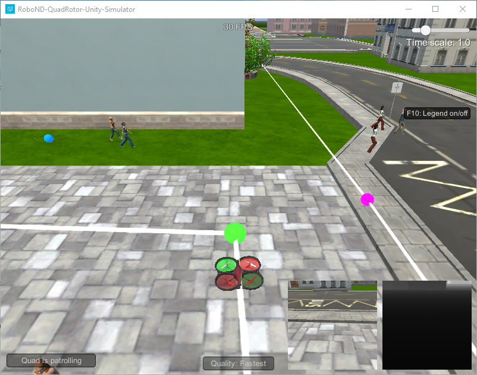

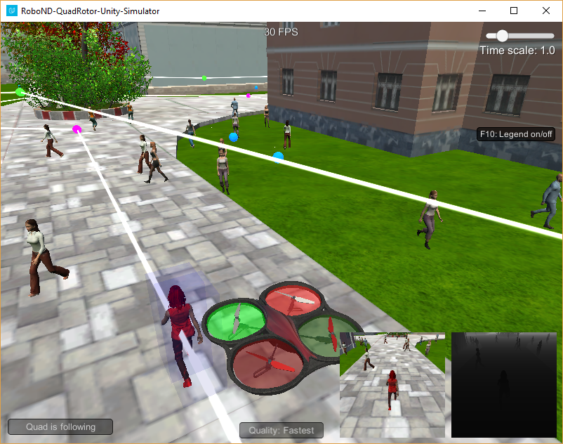

The notebook used for training of the network can be consulted at [model_training.html](model_training.html).

## Potential improvements

The network could be improved in several ways:
- more data could be collected both for training and validation (which would improve visualization of validation accuracy during training of the network)
- data augmentation could be performed adding noise to the images to reproduce limitations of cameras and prevent overfitting at the same time
- the network could be trained longer
- the architecture could be modified, adding either more blocks for a deeper architecture or more filters
- more classes should be created to identify other objects (trees, buildings, animals)

The current architecture can only detect 2 types of objects (tracked person and non-tracked person), the remaining class being used for the background. New masks could be created to detect any type of object (tree, cat…). However, in order to use the same neural network to detect many different objects or people, we would need to add more classes (and masks) to our final layer.

It is to be noted that the network is trained on one specific person. However, if that person changed clothes, it would most likely fail as it has been trained on a single outfit. The network could also fail if the environment (place, weather, day/night) changed as it has not been trained in other conditions.
